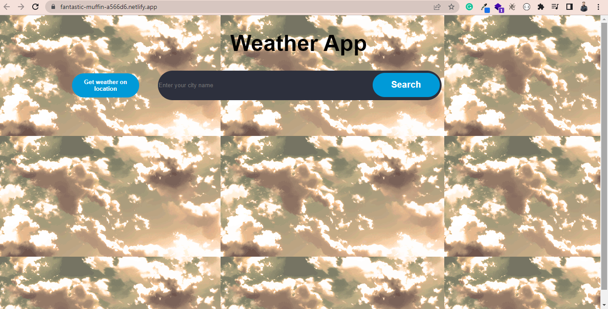

# Weather-App
<h2>Its a mini project where I have fetched the weather data from openweathermap API. Using advanced Html, Css and JavaScript.</h2>

 
<h2>Here we can see the weather of any place in the world.</h2>

 

<h2>Here we can see the weather of whole week of any place in the world.</h2>

